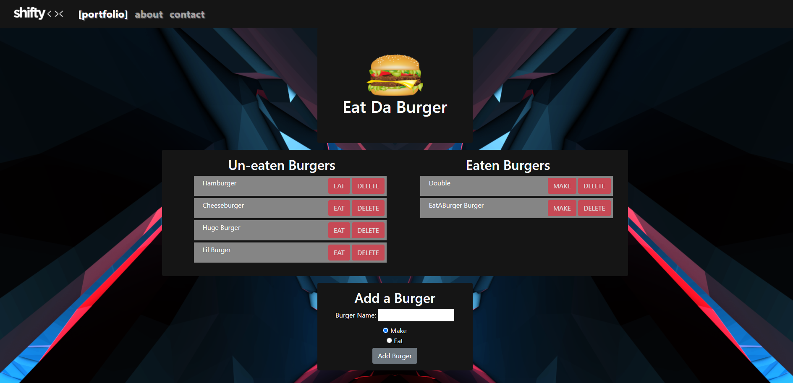

# Eat Da Burger

## Description

Eat Da Burger - a conceptual Node.js, Mysql, & Express-Handlebars application to make, eat, and delete burgers.

## Table of Contents

* [Installation](#installation)
* [Usage](#usage)
* [Credits](#credits)
* [License](#license)

## Installation

[Visit Website](https://shiftymitch-eat-da-burger.herokuapp.com/)

## Usage

1. Visit the app [WEBSITE](https://shiftymitch-eat-da-burger.herokuapp.com/)
2. Click EAT button to eat a burger.
3. Click MAKE button to make a burger.
4. Click DELETE to delete a burger.
5. Enter a name for a new burger, with the option to EAT or MAKE, then click ADD BURGER.

## Credits

[Mitch Henderson](https://shiftymitch.github.io/portfolio/2)
-Wrote the full application.

## License

## Contributing

No contributing necessary.

## Questions

Questions can be directed via email to shiftymitch@gmail.com